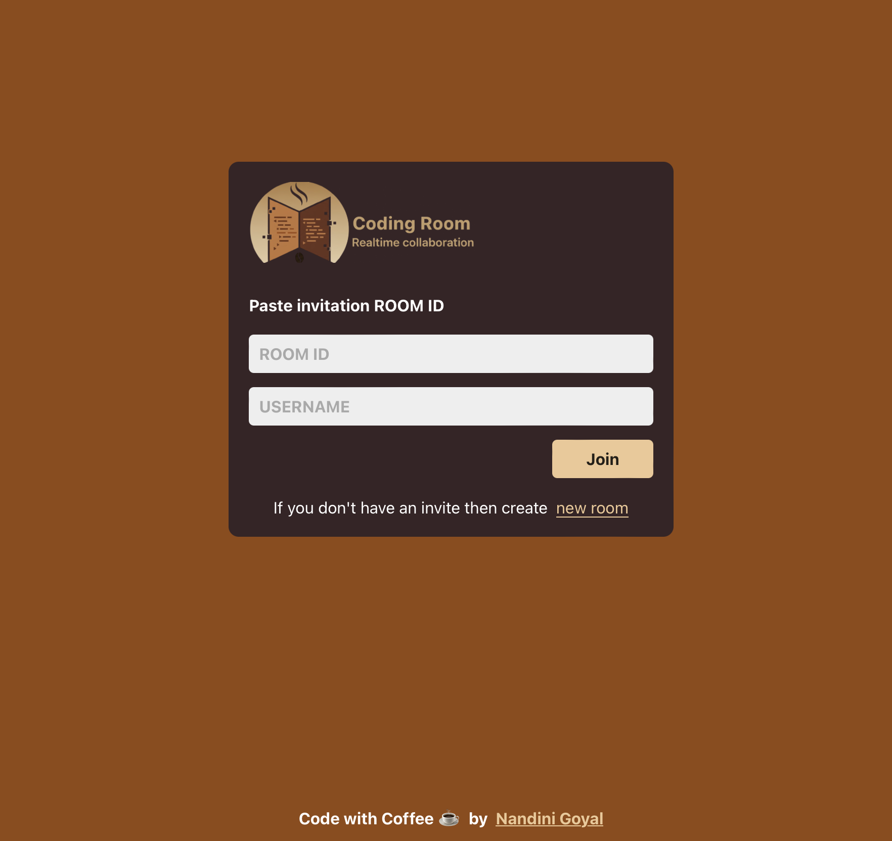

# 💻 Realtime Code Editor

A **realtime collaborative code editor** built with **React**, **Node.js**, and **Socket.io**. Users can join rooms, edit code together, and see each other's changes live.  



---

## 🛠 Features

- 🌐 **Realtime collaboration** using WebSockets
- ✨ **Room-based editing** — join any room with a unique Room ID
- 💾 **Code sync** — latest code is sent to newly joined clients
- 🧑‍🤝‍🧑 **Connected users list** with usernames
- 📋 **Copy Room ID** functionality
- 🖥 **Frontend in React** with live code editor (CodeMirror)
- ⚡ **Backend in Node.js & Socket.io**  

---

## 📦 Tech Stack

- **Frontend:** React, React Router, React Hot Toast, CodeMirror  
- **Backend:** Node.js, Express, Socket.io  
- **Other:** cors, nodemon (for development)  

---

## 🔧 Requirements

Make sure the following are installed on your system:

- [Node.js](https://nodejs.org/) ≥ 18.x  
- npm ≥ 9.x  

---

## ⚡ Setup Instructions

1. **Clone the repository:**

```
git clone https://github.com/NandiniGoyal16/Realtime-Editor.git
cd realtime-editor
```
2. **Install Dependencies:**

```
npm install
```

3. **Create a .env file in the root:**

```
REACT_APP_BACKEND_URL=http://localhost:5001
```

4. **Run the development server (Frontend only):**
```
npm start
```

5. **Run the development server (Backend only):**
```
npm server:dev
```
6. **Open in browser:**
```
http://localhost:3000
```

## Will deploy the project in future :)

## 📦 Dependencies
- react
- react-dom
- react-router-dom
- react-hot-toast
- codemirror
- express
- socket.io
- socket.io-client

## 📜 License
MIT License © 2025

## 🎉 Credits
Built by Nandini Goyal

## 📬 Contact

If you have any questions or suggestions, feel free to reach out!

- Email: nandini04.goyal@gmail.com
- LinkedIn: https://www.linkedin.com/in/nandini-goyal-6b9116259/
- GitHub: https://github.com/NandiniGoyal16
I would love to hear from you! 😊


